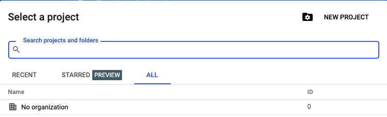
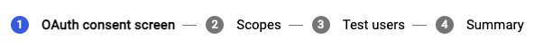
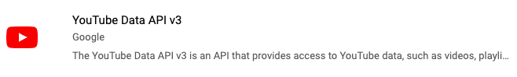
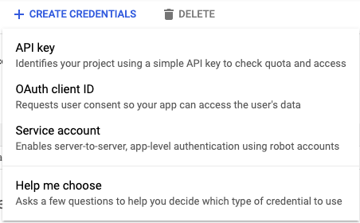
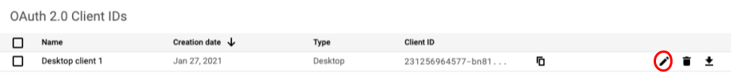

# Youtube Creator CLI
A CLI for Youtube creators, where you can upload, edit, view, and delete videos.

## Installation
Until the [todos](#To-do) are complete, you must install from GitHub.

    $ pip3 install git+https://github.com/gadhagod/Youtube-Creator-CLI

You can install a specific version from GitHub by adding `@[version]` to the target git repository. For example, if you wanted to install `b1.0.0`:

    $ pip3 install git+https://github.com/gadhagod/Youtube-Creator-CLI@b1.0.0

Verify installation by running:

    $ yt --help

## Setup
Go to your [google developer console](https://console.cloud.google.com/). Click <kbd>Select a Project</kbd> on the top left of the screen and <kbd>New Project</kbd>

Name your project.

Click <kbd>OAuth consent screen</kbd> and create a consent screen. Name your app, and add your email. For steps 2-4, you can just click "save and continue".

Click <kbd>dashboard</kbd> and <kbd>Enable APIs and services</kbd> and enable "Youtube API v3".

Now click [<kbd>Credentials</kbd>](https://console.cloud.google.com/apis/credentials) on the left menu. Click <kbd>Create Credentials</kbd> and <kbd>OAuth Client ID</kbd>.

Select "Desktop App" and name the app.
After creating the app, you can now download the credentials file from your credentials page.

Rename the downloaded file to `client_secret.json` and move it to your home directory.

To login with the CLI, run the following:

    yt login

Now click your Youtube account. If you see a message saying "this app is not verified", click "Advanced".

## Commands
The base command is `yt`.
Sub-commands are seperated by spaces. For example, if you wanted to delete a video you would run `yt video delete [CHANNEL ID]`.

- `login [SECRET_FILE (default: $HOME)]` - login to your account.
- `whoami` - verify authentication.
- `channel` - channel commands:
    - `description` - description commands:
        - `show` - show your channel description.
        - `update [UPDATED_DESCRIPTION]` - update your channel description.
    - `stats` - see your channel stats.
- `video` - video commands:
    - `upload [OPTIONS (-t/--title, -d/--description, -t/--tags, -c/--category, -v/--visibility)] FILENAME` - upload a video from your machine.
    - `stats [VIDEO ID]` - view a video's stats.
    - `title` - title commands:
        - `show [VIDEO ID]` - view a video's title.
        - `update [VIDEO ID] [UPATED TITLE]` - update a video's title.
    - `description` - description commands:
        - `show [VIDEO ID]` - view a video's description.
        - `update [VIDEO ID] [UPATED DESCRIPTION]` - update a video's description.
    - `delete [VIDEO ID]` - delete a video.

## Todo
- Make a `video list` command, where you can list all your video's titles. I've been super busy this week but hopefully I can get this done sometime soon.